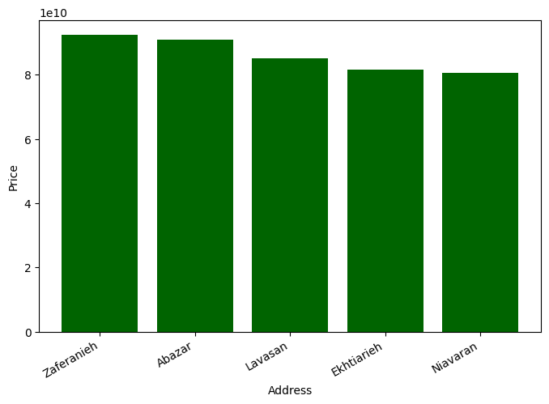

# LLS

## Table of Contents

- [About](#about)
- [Getting Started](#getting-started)
- [Usage](#usage)

## About <a name="about"></a>

In this section, I have implemented the LLS algorithm with two examples.

### Tehran House Price LLS



#### Loss Metrics

- Mean Absolute Error (MAE): 3,299,411,188.31
- Mean Squared Error (MSE): 4.60e+19
- Root Mean Squared Error (RMSE): 6,783,467,730.01

### Dollar to Rial Price

#### Highest Dollar Prices During Presidencies

- Ahmadinejad Presidency: 39,700 Rial
- Rohani Presidency: 320,060 Rial
- Raisi Presidency: 555,600 Rial

#### Lowest Dollar Prices During Presidencies

- Ahmadinejad Presidency: 13,350 Rial
- Rohani Presidency: 12,850 Rial
- Raisi Presidency: 251,250 Rial

#### MAE Loss

- Ahmadinejad: 1.35e+25
- Rohani: 2.95e+26
- Raisi: 1.39e+27

## Getting Started <a name="getting-started"></a>

### Installation

To begin, install the required libraries by running the following command in your terminal:

```bash
pip install -r requirements.txt
```

## Usage <a name = "usage"></a>

Once the requirements are installed, choose a project and run it.

### tehran_house_price_lls

``` terminal
jupyter nbconvert --to script tehran_house_price_lls.ipynb
```

### dollar_rial_price

``` terminal
jupyter nbconvert --to script dollar_rial_price.ipynb
```
