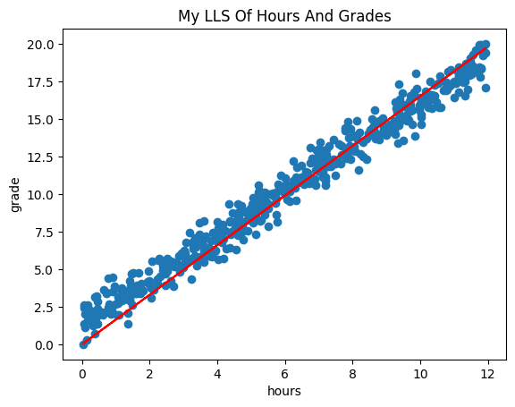
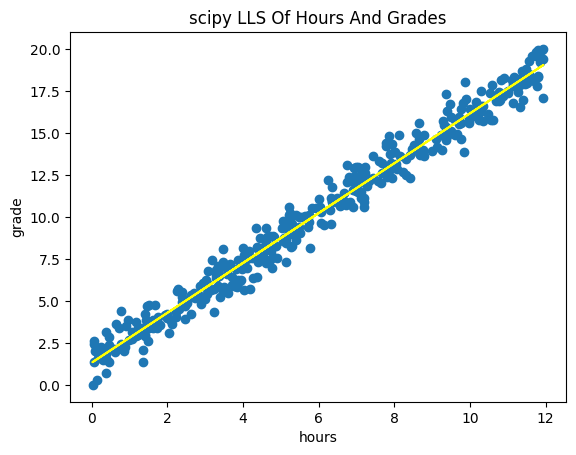
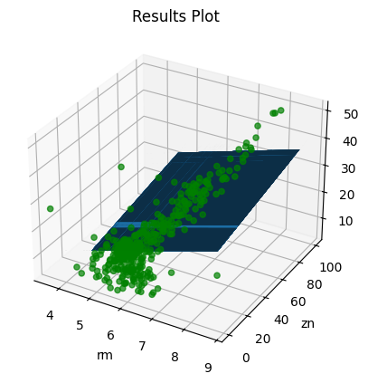

# LLS

## Table of Contents

- [About](#about)
- [Getting Started](#getting_started)
- [Usage](#usage)

## About <a name = "about"></a>

in this part i code LLS algorithm with two example.

### Output

### LLS of Students Grades

my result plot



scipy result plot



### LLS of Boston House Price

result plot



## Getting Started <a name = "getting_started"></a>

### Installing

First of all you need install requirements library copy this code and run in terminal.

``` terminal
pip install -r requirements.txt
```

## Usage <a name = "usage"></a>

After you install requirements library you can choice between the projects and run it.

### student_performance

``` terminal
jupyter nbconvert --to script student_performance.ipynb
```

### boston_house_prices

``` terminal
jupyter nbconvert --to script boston_house_prices.ipynb
```
