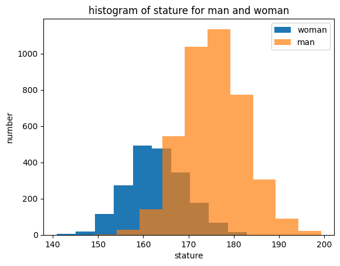
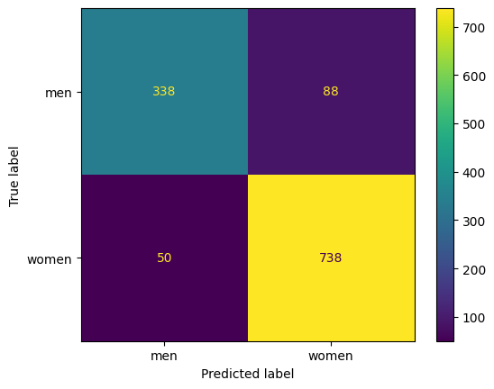

# Knn

## Table of Contents

- [About](#about)
- [Getting Started](#getting_started)
- [Usage](#usage)

## About <a name = "about"></a>

in this part i code knn algorithm.

### Output

histogram of stature for man and woman


confusion matrix plot


| k  | Accuracy of ``KNN algorithm`` (%) |
|----|--------------|
| 9  | [0.8879736408566722] |
| 11 | [0.8887973640856672] |
| 13 | [0.8887973640856672] |
| 15 | [0.8912685337726524] |
| 17 | [0.8887973640856672] |
| 19 | [0.886326194398682]  |

## Getting Started <a name = "getting_started"></a>

### Installing

First of all you need install requirements library copy this code and run in terminal.

``` terminal
pip install -r requirements.txt
```

## Usage <a name = "usage"></a>

After you install requirements library you can choice between the projects and run it.

### scikit-learn knn

``` terminal
jupyter nbconvert --to script ANSUR_knn_sklearn.ipynb
```

### object oriented KNN

``` terminal
jupyter nbconvert --to script ANSUR_knn_model.ipynb
```
