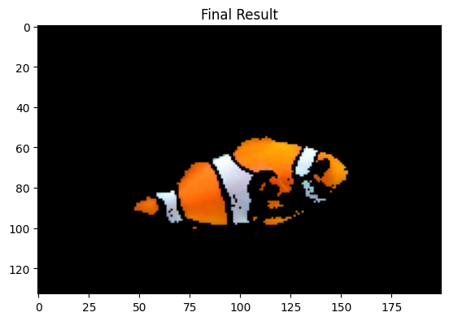
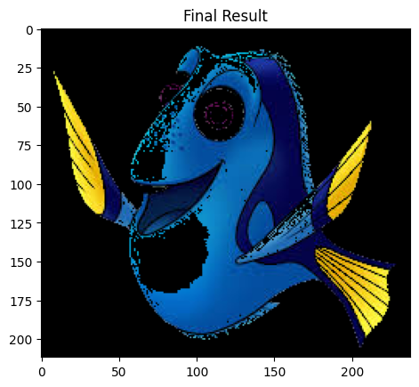
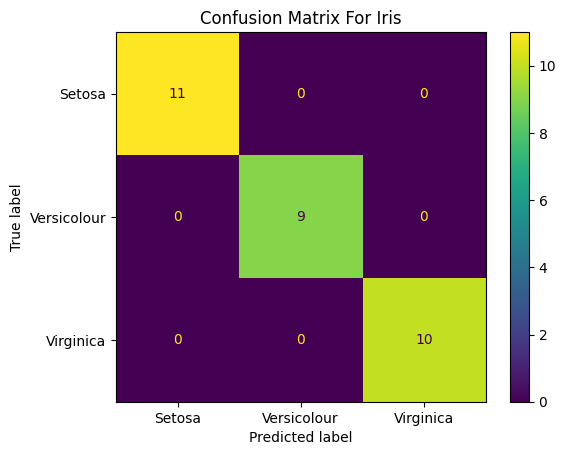
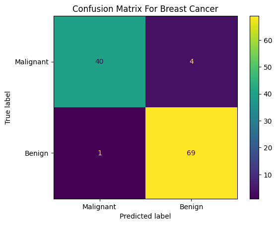

# Knn

## Table of Contents

- [About](#about)
- [Getting Started](#getting_started)
- [Usage](#usage)

## About <a name = "about"></a>

in this part i code knn algorithm.

### Output

### nemo knn

input image


output image



### dory knn

input image


input image



### iris knn

confusion matrix plot



| k  | Accuracy of ``KNN algorithm`` (%) |
|----|--------------|
| 1  | 0.966667 |
| 3 | 0.966667 |
| 5 | 0.966667 |
| 7 | 0.966667 |
| 9 | 1.000000 |
| 11 | 1.000000 |
| 13 | 1.000000 |
| 15 | 1.000000 |
| 17 | 1.000000 |
| 19 | 1.000000 |
| 21 | 1.000000 |

### breast cancer knn

confusion matrix plot



| k  | Accuracy of ``KNN algorithm`` (%) |
|----|--------------|
| 1 | 0.903509 |
| 3 | 0.938596 |
| 5 | 0.956140 |
| 7 | 0.947368 |
| 9 | 0.947368 |
| 11 | 0.956140 |
| 13 | 0.947368 |
| 15 | 0.929825 |
| 17 | 0.947368 |
| 19 | 0.947368 |
| 21 | 0.956140 |

## Getting Started <a name = "getting_started"></a>

### Installing

First of all you need install requirements library copy this code and run in terminal.

``` terminal
pip install -r requirements.txt
```

## Usage <a name = "usage"></a>

After you install requirements library you can choice between the projects and run it.

### nemo_knn

``` terminal
jupyter nbconvert --to script nemo_knn.ipynb
```

### dory_knn

``` terminal
jupyter nbconvert --to script dory_knn.ipynb
```

### iris_knn

``` terminal
jupyter nbconvert --to script iris_knn.ipynb
```

### breast_cancer_knn

``` terminal
jupyter nbconvert --to script breast_cancer_knn.ipynb
```
