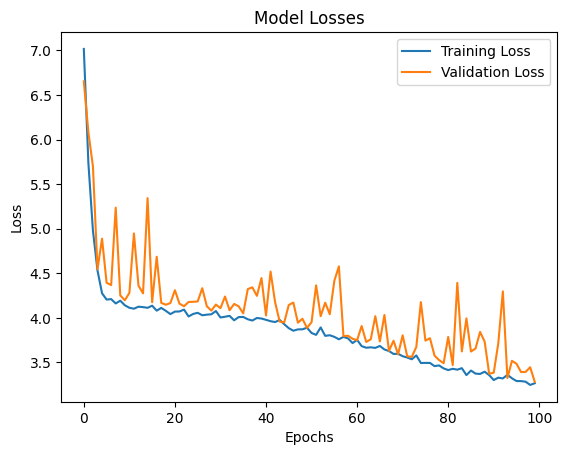
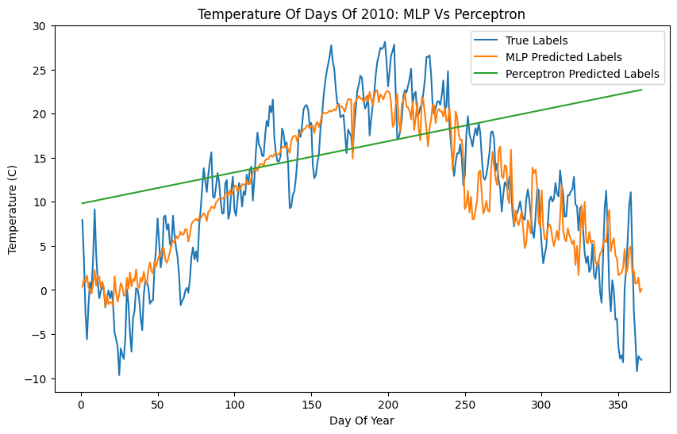
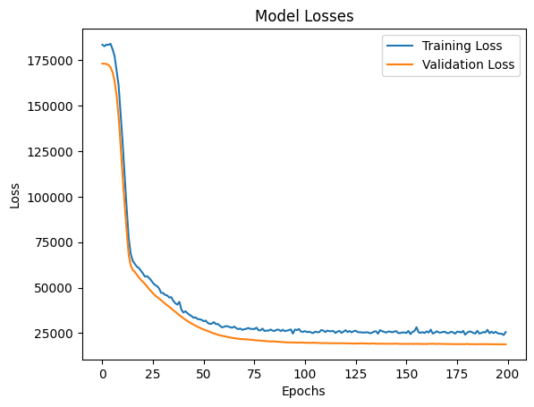
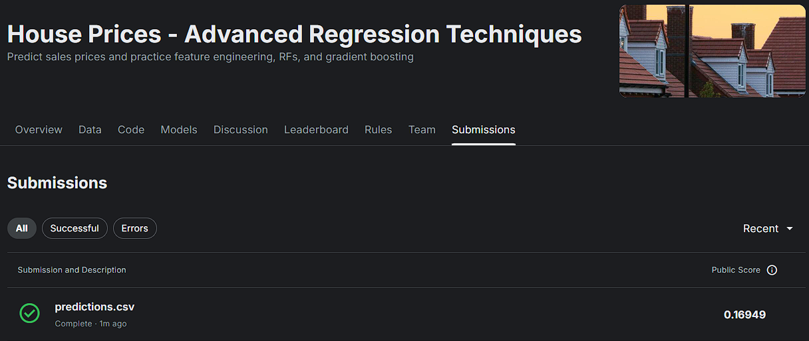

# MLP

## Table of Contents

- [About](#about)
- [Getting Started](#getting-started)
- [Usage](#usage)

## About <a name="about"></a>

In this section, I have implemented the MLP algorithm on Weather dataset and House Price dataset.

### Weather

Model loss



Compare



### House Price

Model loss



model submission



## Getting Started <a name="getting-started"></a>

### Installation

To begin, install the required libraries by running the following command in your terminal:

```bash
pip install -r requirements.txt
```

## Usage <a name = "usage"></a>

If the requirements are installed, choose a project and run it.

### Run Forecast

``` terminal
jupyter nbconvert --to script Forecast.ipynb
```

### Run House Prices

``` terminal
jupyter nbconvert --to script House_Prices.ipynb
```
