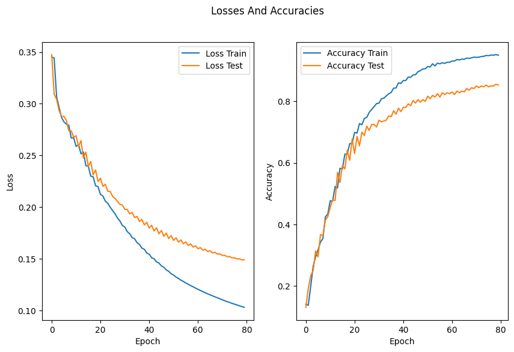
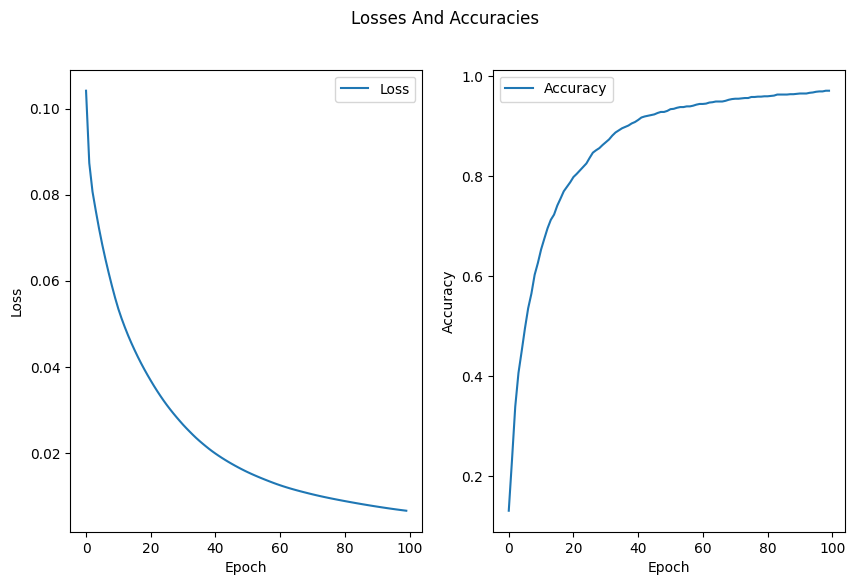

# MLP

## Table of Contents

- [About](#about)
- [Getting Started](#getting-started)
- [Usage](#usage)

## About <a name="about"></a>

In this section, I have implemented the MLP algorithm with some examples and some from scratch useful ML function.

### Multi Layer Perceptron

- loss_train: 0.0336, accuracy_train: 0.8017
- loss_test: 0.0412, accuracy_test: 0.7139

### Onehot Method

#### Results

My Encoder:
[[0, 1, 0], [1, 0, 0], [0, 0, 1]]

My Decoder:
['Male', 'Female', 'Other']

Scikit-Learn Encoder:
[[0. 1. 0.]
 [1. 0. 0.]
 [0. 0. 1.]]

Scikit-Learn Decoder:
['Male', 'Female', 'Other']

### Precision Recall

- Precision (from scratch): 0.6000
- Recall (from scratch): 0.7500

- Precision (scikit-learn): 0.6000
- Recall (scikit-learn): 0.7500

### Simple Neural Network



### Check Predict Method



- loss_test: 0.0168, accuracy_test: 0.9083
- loss_train: 0.0065, accuracy_train: 0.9715

## Getting Started <a name="getting-started"></a>

### Installation

To begin, install the required libraries by running the following command in your terminal:

```bash
pip install -r requirements.txt
```

## Usage <a name = "usage"></a>

Once the requirements are installed, choose a project and run it.

### simple_neural_network

```terminal
jupyter nbconvert --to script simple_neural_network.ipynb
```

### Check_predict_method

```terminal
jupyter nbconvert --to script Check_predict_method.ipynb
```

### multi_layer_perceptron

```terminal
python multi_layer_perceptron.py
```

### Onehot_method

```terminal
python Onehot_method.py
```

### Precision_Recall

```terminal
python Precision_Recall.py
```
