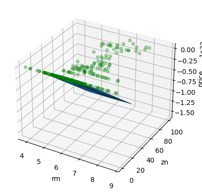

# LLS

## Table of Contents

- [About](#about)
- [Getting Started](#getting-started)
- [Usage](#usage)

## About <a name="about"></a>

In this section, I have implemented the LLS algorithm with two examples.

### abalone perceptron

abalone perceptron 5 epochs


abalone perceptron 50 epochs


### employees salary perceptron

employees salary perceptron with 5 epochs


employees salary perceptron with 50 epochs


### boston house prices

boston house prices perceptron with 50 epochs




## Getting Started <a name="getting-started"></a>

### Installation

To begin, install the required libraries by running the following command in your terminal:

```bash
pip install -r requirements.txt
```

## Usage <a name = "usage"></a>

Once the requirements are installed, choose a project and run it.

### abalone

``` terminal
jupyter nbconvert --to script abalone.ipynb
```

### employees_salary

``` terminal
jupyter nbconvert --to script employees_salary.ipynb
```

### boston_house_prices

``` terminal
jupyter nbconvert --to script boston_house_prices.ipynb
```
