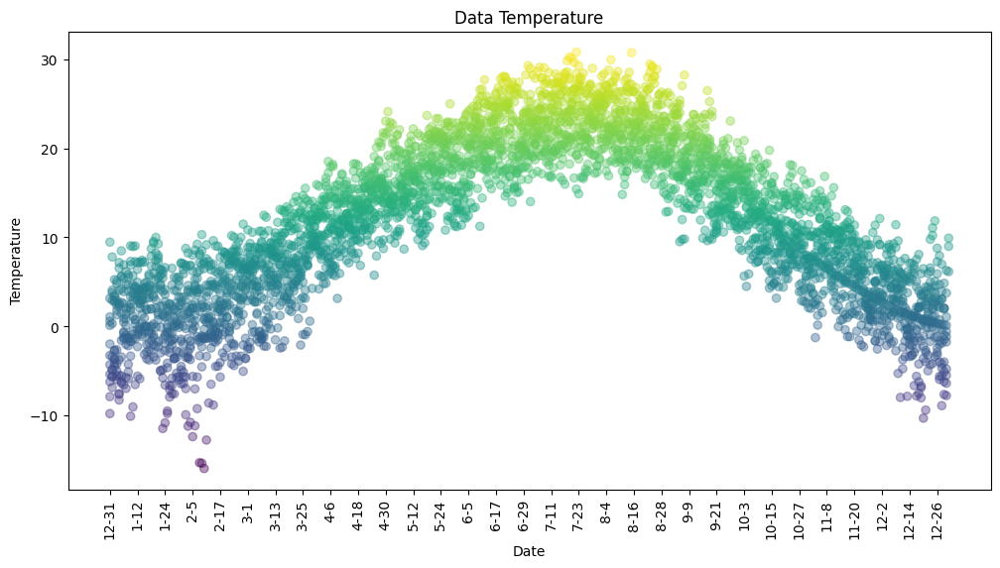

# Perceptron

## Table of Contents

- [About](#about)
- [Getting Started](#getting-started)
- [Usage](#usage)

## About <a name="about"></a>

In this section, I have implemented the perceptron algorithm with two examples.

### perceptron surgical

model accuracy sigmoid


model loss sigmoid


confusion matrix relu


model accuracy tanh


### perceptron forecast

data plot



regression on the data


## Getting Started <a name="getting-started"></a>

### Installation

To begin, install the required libraries by running the following command in your terminal:

```bash
pip install -r requirements.txt
```

## Usage <a name = "usage"></a>

Once the requirements are installed, choose a project and run it.

### perceptron_surgical

``` terminal
jupyter nbconvert --to script perceptron_surgical.ipynb
```

### perceptron_forecast

``` terminal
jupyter nbconvert --to script perceptron_forecast.ipynb
```
