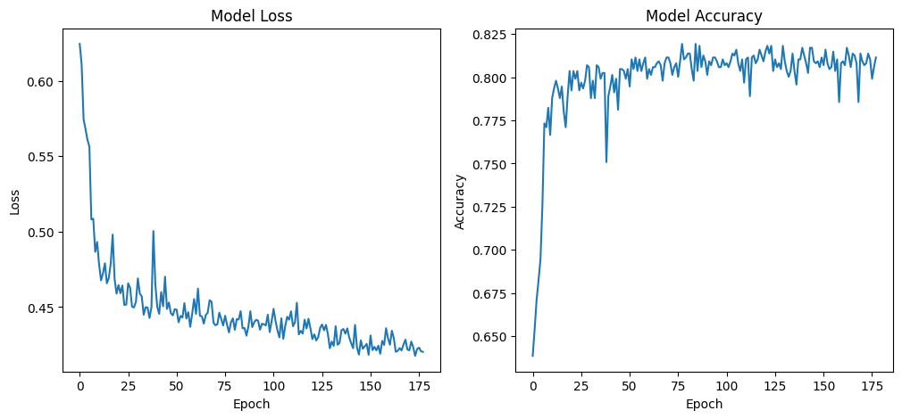

# MLP

## Table of Contents

- [About](#about)
- [Getting Started](#getting-started)
- [Usage](#usage)

## About <a name="about"></a>

In this section, I have implemented the MLP algorithm on titanic dataset.

### Titanic

Model loss and Accuracy



| Algorithm | Accuracy|
|-----------|---------|
| MLP | 0.97 |
| KNN | 0.68 |
| Perceptron | 0.64 |

## Getting Started <a name="getting-started"></a>

### Installation

To begin, install the required libraries by running the following command in your terminal:

```bash
pip install -r requirements.txt
```

## Usage <a name = "usage"></a>

If the requirements are installed, choose a project and run it.

### Run Titanic

``` terminal
jupyter nbconvert --to script titanic.ipynb
```
